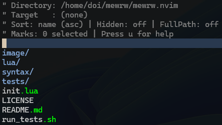
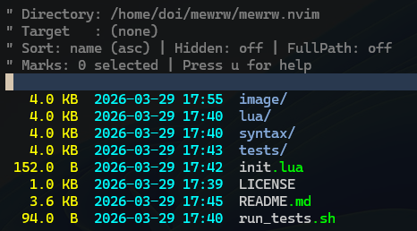
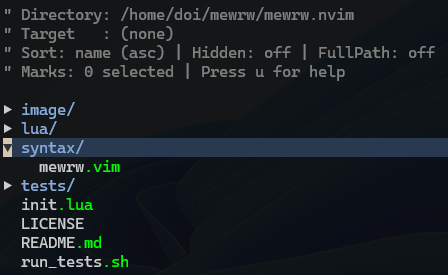
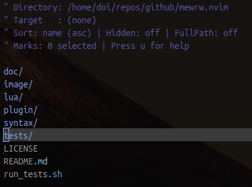
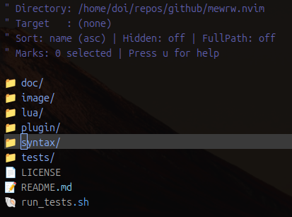
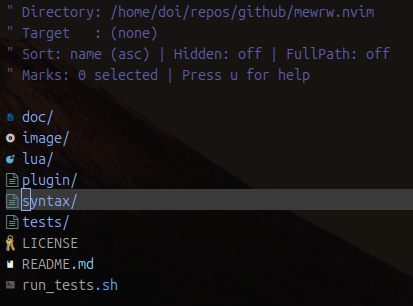
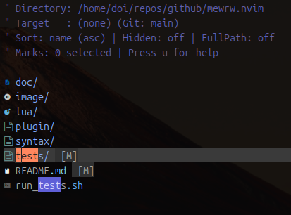
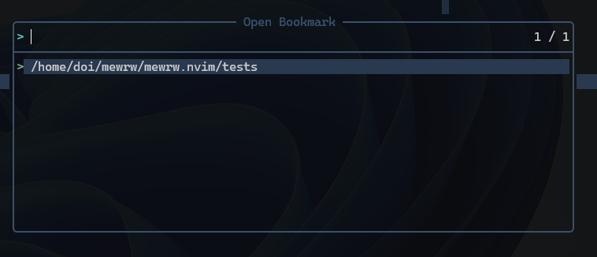
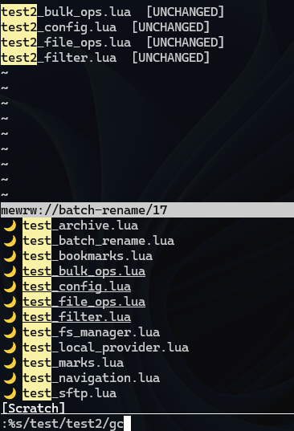

# mewrw

A modern, asynchronous file browser and remote file transfer plugin for Neovim, designed as a powerful and extensible replacement for the built-in `netrw`.

## Features

- **Asynchronous I/O**: All filesystem operations (local and remote) use non-blocking I/O (Libuv or jobstart), ensuring the UI remains perfectly responsive even during large transfers or archive indexing.
- **Unified Interface**: Same experience across Local FS, SFTP, and Archives (`.zip`, `.tar`, `.tar.gz`, `.tgz`).
- **Clean Copy-Paste (Virtual Text)**: Icons and Git status indicators are rendered using Neovim's `extmarks` (virtual text). They are visible in the UI but **do not interfere with text selection or copying**—when you yank a line or copy with a mouse, you get only the clean filename/path.
- **Git Integration**:
  - Displays the current branch in the header.
  - Shows file status (`[M]`, `[A]`, `[?]`, etc.) at the end of the line.
  - **Directory Propagation**: If any file inside a directory is modified, the directory itself will show a `[M]` status.
- **Icon Support**: Choose between `none`, `emoji` (built-in, no extra font required), or `devicons` (requires `nvim-web-devicons`).
- **Global Mark Management**: Mark items across different directories or windows. Selection is shared globally.
- **Target-Based Workflow**: Set a "Target Directory" once and perform Copy/Move operations from any other buffer with a single keypress.
- **Advanced Tree View**: Visual hierarchy with recursive expansion (`E`) and navigation.
- **Windows Friendly**: Full support for drive letters (e.g., `C:/`), network shares, and a virtual "This PC" root (`/`) to switch between drives.
- **Persistent Bookmarks**: Quickly save and recall locations via a persistent selection menu.

## Screenshots

**View Modes**

| Default (List) | Detailed | Tree View |
| :---: | :---: | :---: |
|  |  |  |

**Icon Styles**

| None | Emoji (Built-in) | Devicons (Nerd Font) |
| :---: | :---: | :---: |
|  |  |  |

**Advanced Features**

| Git Signs | Bookmarks | Batch Rename |
| :---: | :---: | :---: |
|  |  |  |

## Installation

Using [lazy.nvim](https://github.com/folke/lazy.nvim):

```lua
{
    "hdoi/mewrw.nvim",
    dependencies = { "nvim-tree/nvim-web-devicons" }, -- Optional: for 'devicons' mode
    config = function()
        require("mewrw").setup({
            icons = "emoji",            -- "none", "emoji", or "devicons"
            git_integration = true,      -- Enable git status and branch info
            default_view_mode = "list",  -- "list", "detailed", or "tree"
        })
    end
}
```

## Usage

### Commands

| Command | Action |
| :--- | :--- |
| `:Mewrw [uri]` | Open explorer in the current window |
| `:MewrwV [uri]` | Open in a vertical split |
| `:MewrwH [uri]` | Open in a horizontal split |
| `:MewrwT [uri]` | Open in a new tab |
| `:Explorer [uri]` | Alias for `:MewrwH` (compatible with netrw habits) |

### URI Schemes

- **Local**: `.` or `/path/to/dir` or `C:/path/to/dir`
- **SFTP**: `sftp://user@host/path`
- **Archives**:
  - Linux: `zip:///abs/path.zip::internal/path` (Note the triple slash for absolute paths)
  - Windows: `zip://C:/path.zip::internal/path`
  - Relative: `zip://./local.zip::internal/path`

## Key Mappings

Press `u` within any `mewrw` buffer to see the interactive help popup.

| Key | Action |
| :--- | :--- |
| `<CR>` | Open file (edit) or enter directory |
| `-` / `<BS>` | Go up to parent directory (Exits archives if at root) |
| `R` | Reload/Refresh current view |
| `i` | Cycle View Mode (List → Detailed → Tree) |
| `a` | Toggle display of Hidden files (dotfiles) |
| `?` | Live filter entries in the current view |
| `mf` | Toggle mark (supports Visual mode) |
| `TT` | Set current directory as **Global Target** |
| `Tc` | Copy marked items to **Global Target** |
| `Tm` | Move marked items to **Global Target** |

## Requirements

- Neovim 0.8+
- **For SFTP**: `sftp` command.
- **For Archives**: `zip`, `unzip`, or `tar` (standard on Windows 10+) commands.
- **For Icons**: `nvim-web-devicons` (optional, only for `icons = "devicons"`).

## License

MIT
